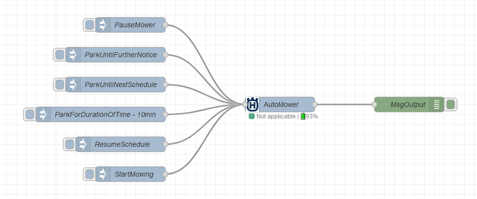

# node-red-contrib-husqvarna-automower-connect
Node to control and monitor Husqvarna Mower with the Automower Connect API.
Tested on a Husqvarna Automower® 315X.

## Getting started

### 1. Get developer access
1. Create an account on the [Husqvarna developer website](https://developer.husqvarnagroup.cloud/apis/gardena-smart-system-api)
2. Create a new application
    - Application name: Your choice
    - Description: Can be left empty 
    - Redirect URLs: `http://localhost` (Doesn't matter because we won't use it)
3. Connect correct API's to your newly created application (Big orange button: 'Connect new API')
    - Authentication API
    - Automower Connect API
4. Use Application key and secret in the configuration of this node as `API Key` and `Client Secret`

### 2. Install the nodes in your palette
1. Go to 'Manage palette' in the menu of node-red
2. Go to the 'Install' tab
3. Search for `node-red-contrib-husqvarna-automower-connect`
4. Install the node

### 3. Configure the mower & config node
1. Drag a 'Husqvarna Mower' node on your flow
2. Enter the previously acquired API Key & Client Secret
4. Click the search button to scan for 'mowers'
5. Select the appropriate mower
6. Save your node
7. Go!

## Using the mower node

### Receiving updates from the mower
When a status update is available for the Husqvarna mower, a new message is sent:
- msg.mower: id & name of the mower
- msg.payload: latest values of all attrbutes
    - connected
    - batteryPercent
    - state
    - stateTs
    - nextStartTs
    - mode
    - activity
    - errorCode
    - errorCodeTs
    - overrideAction,
    - restrictedReason
- msg.updatesList: list of attributes which have been updated

### Commanding your mower
You can command the mower by sending a message with:
- msg.action:
    - pauseMower
    - parkUntilNextSchedule
    - parkForDurationOfTime
    - resumeSchedule
    - startMowing
- msg.duration: Duration in minutes (only for optional 'startMowing' and required for 'parkForDurationOfTime' action)

## Example flow

https://github.com/jochamsa/node-red-contrib-husqvarna-automower-connect/blob/main/examples/AutomowerDemoFlow.json
